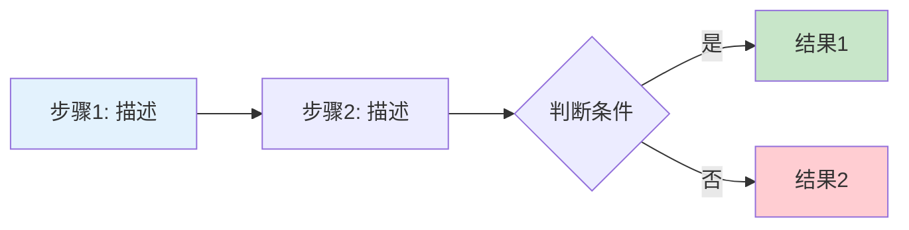

# 析题

## Keywords

析题、启发式题解、解题报告、题目分析、代码精讲、逐行讲解

## Summary

为竞赛题目生成启发式题解，核心是「教人思考」而非「给答案」。

## 触发

- 用户要求写「题解」「解题报告」「题目分析」「代码精讲」
- 用户给题面（URL/文件/文本），期望思路解读
- 用户给标程文件，要求逐行讲解

## 不触发

- 仅搬运/翻译/打包题目 → 搬题姬
- 仅生成测试数据 → 搬题姬
- 说「这题怎么做」但无题面无上下文 → 先确认题面

## Strategy

### 1. 拿题面

| 输入 | 方法 |
|------|------|
| URL | urlgo snapshot（不可用时 WebFetch） |
| 文件 | Read |
| 对话文本 | 直接使用 |
| 标程文件 | Read，融入精讲 |

### 2. 定深浅

看分值 + 数据范围（数值为参考，非铁律）：

| 深度 | 参考分值 | 写法 |
|------|----------|------|
| 浅 | ≤ 250 | 一两段说清思路，代码关键行加注。无须逐步推演，无须错误表 |
| 中 | 250~450 | 展示核心思维过程，公式用 LaTeX + 数值例，附 2~3 条常见错误 |
| 深 | ≥ 450 | 暴力 → 撞墙 → 优化 → 数据结构选型，充分展开，代码逐段精讲 |

若分值跨越边界，或数据范围异常大/小，AI 自行判断深度，宁浅勿深。

> **Human-in-the-Loop**：定完深浅后问用户——"本题我判断为 X 难度，您希望浅写还是深写？有没有特定标程要我精讲？"

### 3. 写（因题制宜，无固定模板）

**排列组合自由，但必须覆盖以下六点**：

1. **直觉入口**——读完题的第一反应（哪怕是最笨的暴力）
2. **关键转折**——什么观察让你找到了正确的路？展示歧路 → 正解的思维跳跃
3. **代码呈现**——贴代码，关键行加注释。不贴裸代码
4. **复杂度**——时间 + 空间复杂度拆解
5. **常见陷阱**——容易踩的坑（浅度可省略）
6. **样例保真**——题面样例原样保留，绝不篡改

六点可自由组合。可先贴代码再解释，也可边推演边贴片段。因题制宜。

若是比赛多题，题与题独立成节，末尾加串讲总结。

详见 `steps/02-write.md`。

### 4. 写作心法（析题特色）

以下三点是析题区别于普通题解的关键：

#### 4a. 公式要用数值例解释

不要只扔一行 LaTeX 就跑。数学符号对部分读者是黑话，必须配一个具体数值例子。

```
不好：concat(x,y) ≡ x + y (mod M)
好：  concat(2,1)=21, 21÷2=10余1, 2+1=3÷2=1余1 → 余数相同 ✓
```

实操规则：**每个公式后面紧跟一个「举个例」**。例子用小数字，读者能心算。

#### 4b. 展示歧路，而非绕过歧路

遇到需要「关键转折」的题，先写**为什么第一反应是错的**，再写正确的路。

```
不好：观察到 BFS 距离奇偶性即可
好：  第一反应 BFS 距离偶→#、奇→.，但全黑格全部输出 #
      手动追两步发现全黑格 step1 全白后就再也回不来了
      所以需要另一个视角——距离最近白格的距离——补齐盲区
```

读者需要知道**为什么简单的解法不够**，才能理解复杂解法的必要性。

#### 4c. 「对面视角」技巧

当问题从某个角度难以直接求解时，主动反问：

> 反过来呢？从对立面出发呢？

典型案例（今日 ABC460 D）：
- 第一 BFS：每个格子到最近 `#` 的距离 → 对 `.` 格子有效
- 第二 BFS：每个格子到最近 `.` 的距离 → 对 `#` 格子有效
- 两者互补，覆盖全部

在题解中标注这种「换视角」的时刻，帮助读者建立思维灵活性。

## 交付要求

- 格式：Markdown
- 代码块用 ```cpp
- 数学用 LaTeX（`$` 行内，`$$` 行间）
- **图表用 Mermaid**（流程图、步骤图、验证图等，见下方规范）
- 有标程必须逐关键行精讲
- 每题必须包含复杂度分析

### Mermaid 图表规范

**必须使用 Mermaid 的场景：**

| 场景 | 图表类型 | 示例 |
|------|---------|------|
| 算法主流程 | flowchart TD | 从输入到输出的完整流程 |
| 构造/转换过程 | flowchart LR | A → B → C → D 的步骤链 |
| 思维分支/决策 | flowchart TD | 条件判断、路径选择 |
| 样例验证 | table | 逐行验证（不用 flowchart，太冗长） |

**禁止使用的图表：**

- ❌ pie chart（渲染效果差，数据不可读）
- ❌ 复杂的 subgraph 嵌套（保持扁平）
- ❌ 超过 8 个节点的单链 flowchart（拆分或用 table）

**Mermaid 写法要点：**



- 节点文字用引号包裹，支持 `<br/>` 换行
- 用 `style` 给关键节点着色（起点蓝、终点绿、判断橙、错误红）
- 子图（subgraph）仅在逻辑分组明确时使用，否则保持扁平

## AVOID

- ❌ 先给最优解再解释——读者不知道你为什么想到它
- ❌ 说「显然」「易知」「不难发现」跳过关键推理
- ❌ 对所有题用同样深度——100 分的题不配 500 字
- ❌ 篡改样例（尤其 AtCoder 比赛禁令期间）
- ❌ 代码不加注释
- ❌ 忘记复杂度分析
- ❌ **套固定模板**——因题制宜，每道题有自己的写法
