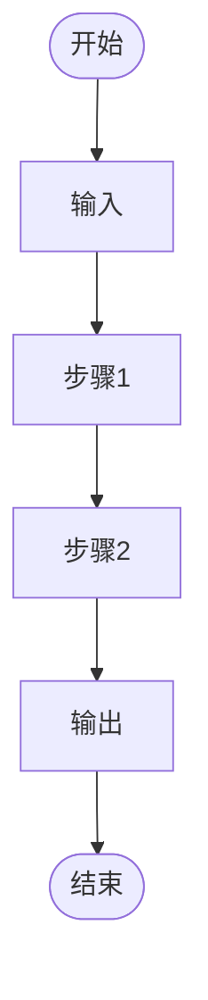
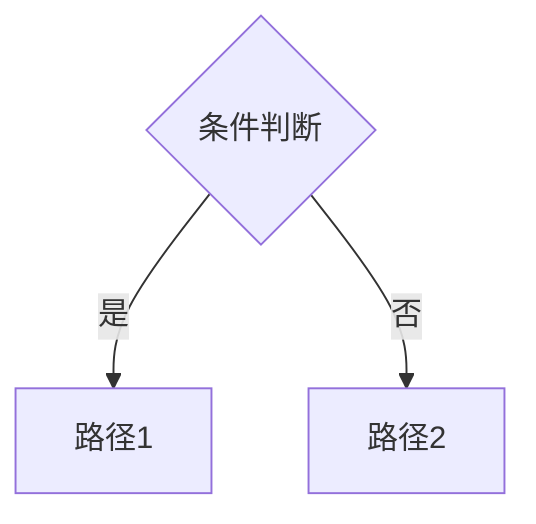

# Step 2：撰写题解

## 前置条件

- 已获取题面（来自 `01-prepare.md`）
- 已与用户确认深度偏好
- 若有标程文件，已读取待用

## 核心原则

**因题制宜，无固定模板。** 以下只是方向性约束，不是结构要求。

### 必须覆盖的六项内容

| # | 内容 | 说明 | 简单题 | 中难题 |
|---|------|------|--------|--------|
| 1 | 直觉入口 | 读完题的第一反应 | 一两句带过 | 展开写暴力思路 |
| 2 | 关键转折 | 什么观察让你找到正解 | 直接说思路 | 展示歧路→正解 |
| 3 | 代码 | 带注释的代码 | 关键行加注 | 逐段精讲 |
| 4 | 复杂度 | 时间 + 空间 | 必须写 | 必须写 |
| 5 | 常见陷阱 | 易踩的坑 | 可省略 | 2~3 条 |
| 6 | 样例保真 | 原样保留 | 必须 | 必须 |

### 组织方式：自由

六项内容可自由排列组合。以下只是**可能性示例**，不是模板：

```
写法 A：先贴代码 → 再分段解释 → 最后总结坑
写法 B：先推演思路 → 边推演边贴代码片段 → 最后贴完整代码
写法 C：先讲暴力 → 撞墙 → 优化三步走 → 代码收尾
```

选哪种取决于题目特点。关键是**让读者读起来顺畅**，不是套格式。

## ⚠️ 公式写法（析题特有）

数学公式必须配**具体数值例子**，公式和例子不可分离。

### 错误示范

```
不好：concat(x,y) ≡ x + y (mod M)
```

读者可能不认识 `≡`、不知道 `mod` 怎么算、不知道 concat 是什么。一段话塞三个黑话。

### 正确示范

```
好：
"≡" 读作"同余于"，意思就是"余数相等"。
concat(2,1) = 21，21 ÷ 2 = 10 余 1
x + y = 2 + 1 = 3，3 ÷ 2 = 1 余 1
余数都是 1，所以 (2,1) 满足条件 ✓
```

### 规则

1. **每个参数举一个具体数字**（x=2, y=1, M=2 这种小的）
2. **一步步演示计算过程**，不要跳步
3. **说清符号含义**——`≡` 是什么、`mod` 是什么意思——默认读者不知道
4. **用完例子马上回到通用公式**：例子是垫脚石，不是终点

## 歧路展示的基本原则

中难题必须包含「错误直觉→撞墙→修正」的叙述弧：

### 通用结构

```
问题：________
第一反应：________（为什么这是自然的）
为什么不对：________（具体反例）
转折观察：________（什么让你醒悟）
修正后：________（正确解法）
```

### 反例选择指南

寻找反例的原则：

- **边界值**：N=1, 最小/最大输入
- **全同**：所有元素相同（全黑、全零）
- **聚集**：同类元素聚在一起（而非均匀分布）
- **极端形状**：单行、单列、1x1

## 从今日实战提炼的技巧

### 「对面视角」技巧

当问题从某个视角难以处理时，主动从对立面切入。

典型案例——ABC460 D 反复涂色：

```
第一视角（到最近 '#' 的距离）→ 对 '.' 格子有效
对面视角（到最近 '.' 的距离）→ 对 '#' 格子有效
两者互补 → 完整覆盖全部格子
```

在题解中标注「换视角」的时刻，帮助读者建立思维灵活性。

### 边界值排查清单

写完解法后，主动用以下清单排查：

| 检查项 | 案例 | 今日教训 |
|--------|------|---------|
| 最大值是否需要多一位/多一轮 | N=10^18 是 19 位不是 18 位 | E 题漏了 k=19 |
| 全同输入是否退化 | 全黑格 BFS 失效 | D 题全黑特判 |
| 1x1 极端 | 1x1 `#` 输出 `.` 不是 `#` | D 题边界 |
| 聚集模式是否异常 | 黑块中心白格触发失败 | D 题双 BFS 修复 |

## 多题（比赛）场景

若题目有多道（如 ABC A~E）：

- **题与题独立**：每道题自成一节，读者可以只看卡住的那题
- **深度差异化**：A/B 浅写，C/D 中度，E/F/G 深度展开
- **末尾串讲**：一段话或一张表，概括各题核心技巧与思维递进关系

## 代码处理规则

- 若用户提供了标程文件路径 → 必须逐关键行精讲该标程
- 若用户没给标程 → 自己写实现，或引用已知解法
- 关键行加注：不写 `// 循环` 这种废话，要写 `// 左子树：中序[l, p-1]`
- **代码风格**遵循主技能文档第 5 节「代码风格约定」——短变量、全局、少传参、左大括号另起一行
- **传参优化**：多参数递归优先改写成「全局光标 + 区间边界」模式

### 代码风格速查

| 场景 | 不好 | 好 |
|------|------|-----|
| 根节点变量 | `int root = pre[l1];` | `int rt = a[k++];` |
| 递归传参 | `dfs(l1+1, l1+l, l2, p-1);` | `dfs(l, p-1);` |
| 多行注释 | `// 这里递归处理左子树` | `// 左子树：中序[l, p-1]` |
| 存结果 | `vector<int> ans; ans.push_back(rt);` | `cout << rt;` 或 `ans[++cnt] = rt;` |

## 留空练习模式（仅按需启用）

**默认不挖空。仅在用户说「留空」「挖空」「填空」时启用。**

启用后写作方式调整如下：

1. **文字描述中嵌入答案**——将挖空处的答案显式写在代码前的文字里
   ```
   好：在文字中写"用 a[k++] 取前序当前位置为根，光标后移"
       代码中留空 char rt = _______;
   ```
2. **挖 3 空**——只挖核心逻辑：
   - 递归出口条件（`l > r`）
   - 关键操作（如何取根）
   - 比较对象（`b[p] != rt` 中的 `rt`）
3. **开头加说明**——「下面代码挖去了若干关键处，答案已在前面描述中，仔细读一遍就能填上。」
4. **不走样**——留空不影响代码可读性，`______` 长度统一为 6 个下划线

## Mermaid 图表使用指南

### 何时用 Mermaid

| 内容 | 用 Mermaid | 用 Table |
|------|-----------|----------|
| 算法主流程 | ✅ flowchart TD | — |
| 构造/转换步骤 | ✅ flowchart LR | — |
| 思维分支 | ✅ flowchart TD | — |
| 复杂度对比 | — | ✅ 表格更清晰 |
| 样例验证 | — | ✅ 表格更清晰 |
| 公式推导 | — | ✅ 文字+公式 |

### Mermaid 模板库

**模板 1：算法主流程**


**模板 2：构造步骤链**


**模板 3：决策分支**


**模板 4：代码执行推演**


### 样式规范

- 起点：`style Start fill:#ff9800,color:white`
- 终点：`style End fill:#ff9800,color:white`
- 正常步骤：`style A fill:#e3f2fd`
- 判断节点：`style B fill:#fff3e0`
- 成功结果：`style C fill:#c8e6c9`
- 失败结果：`style D fill:#ffcdd2`

### 禁忌

- ❌ 不用 pie chart（渲染效果差）
- ❌ 不用超过 8 节点的单链（改用 table 或拆分）
- ❌ 不用多层嵌套 subgraph（保持扁平）
- ❌ 不在 flowchart 里放长文本（用 table）

## 自我检查

写完后对照以下清单（非必须逐条，但需心里有数）：

- [ ] 是否从直觉出发，而非直接给最优解？
- [ ] 是否有至少一行代码加了有意义的注释？
- [ ] 是否给出了复杂度分析？
- [ ] 是否有"显然""易知"这类跳步词？删除。
- [ ] 样例是否原样保留？
- [ ] 整体是否在教人思考，而非给答案？
- [ ] 公式后面是否配了具体数值例子？（析题特有）
- [ ] 中难题是否展示了歧路 → 修正的过程？
- [ ] 是否用边界清单排查过退化输入？
- [ ] 代码是否遵循 OI 风格（短变量、全局、少传参、大括号新行）？
- [ ] 传参能否进一步精简？（如用全局光标 + 区间边界代替多参数）
